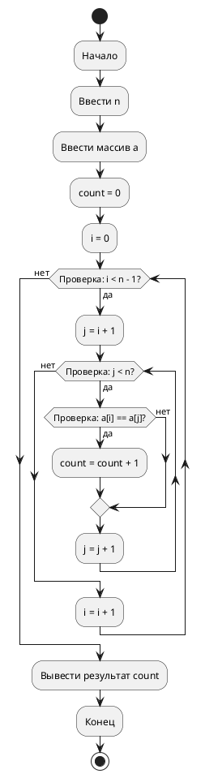
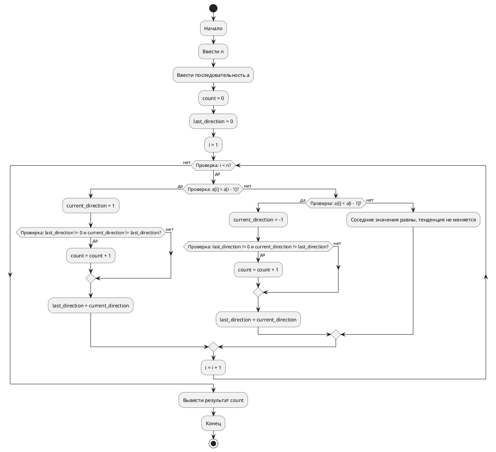

## Рабочая тетрадь 21. Задание 9

### 1. Условие задачи

Построить блок-схему алгоритма обработки массива из чисел, в котором требуется определить количество пар элементов, равных друг другу. Алгоритм должен использовать вложенный цикл.

### 2. Краткое описание алгоритма словами

Сначала вводится число `n` — размер массива. Затем вводится массив `a`, состоящий из `n` чисел.

Создаётся счётчик `count = 0`, в котором будет храниться количество найденных пар равных элементов.

Далее используется вложенный цикл:

- внешний цикл перебирает индекс `i` от `0` до `n - 2`;
- внутренний цикл перебирает индекс `j` от `i + 1` до `n - 1`;
- если элементы `a[i]` и `a[j]` равны, то счётчик `count` увеличивается на `1`.

После завершения циклов выводится значение `count`.

### 3. Код блок-схемы на PlantUML



### 4. Простой эквивалентный код на Python

```python
n = int(input())
a = list(map(int, input().split()))

count = 0

for i in range(0, n - 1):
    for j in range(i + 1, n):
        if a[i] == a[j]:
            count = count + 1

print(count)
```

### 5. Пример ввода и вывода

Ввод:

```text
5
1 2 1 3 2
```

Пояснение:

В массиве есть две пары равных элементов:

- `1` и `1`;
- `2` и `2`.

Всего получилось `2` пары.

Вывод:

```text
2
```

### 6. Короткий вывод

В этом задании используется циклический алгоритм с вложенным циклом. Внешний цикл выбирает первый элемент пары, а внутренний цикл сравнивает его с остальными элементами массива.

## Рабочая тетрадь 23. Задание 9

### 1. Условие задачи

Построить блок-схему и реализовать на языке Python алгоритм анализа последовательности измерений, в котором требуется определить моменты изменения тенденции данных.

Требуется:

- вводить последовательность из `n` чисел;
- определить, сколько раз при просмотре последовательности происходил переход от возрастания к убыванию или от убывания к возрастанию;
- не учитывать повторяющиеся соседние значения как изменение тенденции;
- вывести количество обнаруженных изменений тенденции;
- пояснить, какие переменные необходимы для хранения предыдущего состояния последовательности;
- выполнить проверку алгоритма на нескольких тестовых последовательностях.

### 2. Краткое описание алгоритма словами

Сначала вводится число `n` — количество измерений. Затем вводится последовательность `a` из `n` чисел.

Нужно определить, сколько раз меняется направление движения данных:

- если следующее число больше предыдущего, то направление — возрастание;
- если следующее число меньше предыдущего, то направление — убывание;
- если числа равны, направление не меняется и такая пара не учитывается.

Для решения используются переменные:

- `n` — количество чисел;
- `a` — последовательность измерений;
- `count` — количество изменений тенденции;
- `last_direction` — предыдущее направление последовательности;
- `current_direction` — текущее направление между двумя соседними разными числами;
- `i` — индекс для просмотра последовательности.

Значение `last_direction` удобно хранить так:

- `0` — направление ещё не определено;
- `1` — было возрастание;
- `-1` — было убывание.

Алгоритм:

1. Ввести `n`.
2. Ввести последовательность `a`.
3. Присвоить `count = 0`.
4. Присвоить `last_direction = 0`.
5. Просмотреть соседние элементы последовательности.
6. Если `a[i] > a[i - 1]`, то `current_direction = 1`.
7. Если `a[i] < a[i - 1]`, то `current_direction = -1`.
8. Если `a[i] == a[i - 1]`, то переход не учитывать.
9. Если предыдущее направление уже было известно и новое направление отличается от него, увеличить `count` на `1`.
10. Запомнить новое направление в `last_direction`.
11. После завершения цикла вывести `count`.

### 3. Код блок-схемы на PlantUML



### 4. Простой эквивалентный код на Python

```python
n = int(input())
a = list(map(int, input().split()))

count = 0
last_direction = 0

for i in range(1, n):
    if a[i] > a[i - 1]:
        current_direction = 1

        if last_direction != 0 and current_direction != last_direction:
            count = count + 1

        last_direction = current_direction

    elif a[i] < a[i - 1]:
        current_direction = -1

        if last_direction != 0 and current_direction != last_direction:
            count = count + 1

        last_direction = current_direction

print(count)
```

### 5. Пример ввода и вывода

Пример 1.

Ввод:

```text
7
1 3 5 4 2 6 7
```

Пояснение:

Сначала последовательность возрастает: `1, 3, 5`.
Потом начинается убывание: `5, 4, 2`. Это первое изменение тенденции.
Потом снова начинается возрастание: `2, 6, 7`. Это второе изменение тенденции.

Вывод:

```text
2
```

Пример 2.

Ввод:

```text
6
5 5 4 4 3 2
```

Пояснение:

Повторяющиеся соседние значения `5 5` и `4 4` не считаются изменением тенденции. Последовательность только убывает, поэтому изменений нет.

Вывод:

```text
0
```

Пример 3.

Ввод:

```text
8
1 2 2 3 2 2 4 1
```

Пояснение:

Переход от возрастания к убыванию происходит на участке `3, 2`.
Переход от убывания к возрастанию происходит на участке `2, 4`.
Переход от возрастания к убыванию происходит на участке `4, 1`.
Повторы `2 2` не учитываются.

Вывод:

```text
3
```

### 6. Короткий вывод

В этом задании используется циклический алгоритм с условиями. Цикл нужен для просмотра соседних элементов последовательности, а условия нужны для определения возрастания, убывания и изменения тенденции.
