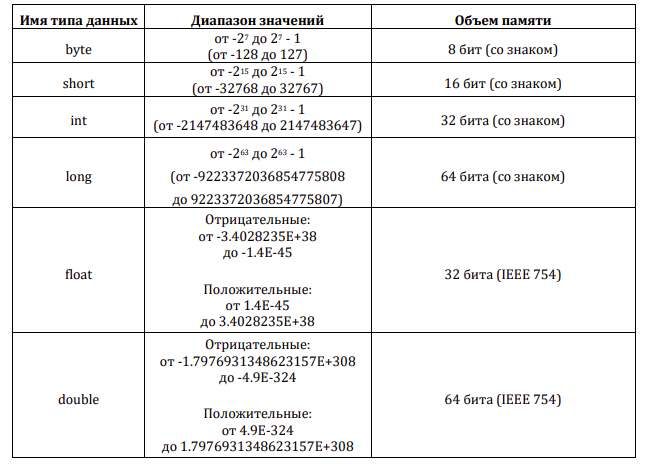
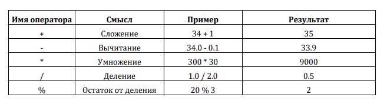
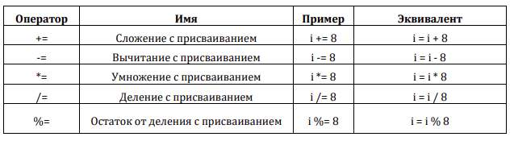
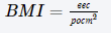
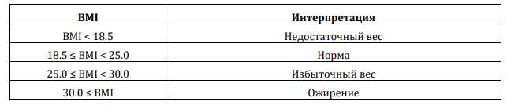
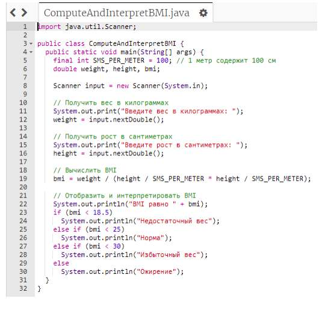
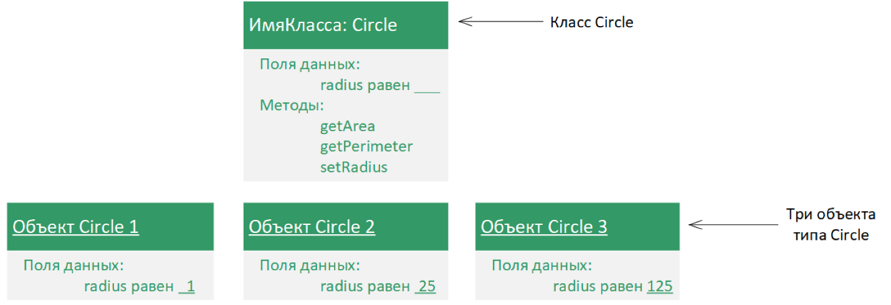

# Практическая работа №1 Знакомство с intellij idea. Разбор синтаксиса языка программирования Java, типы данных и арифметические выражения, структуры выбора и циклы. Знакомство с ООП.

## Теория

### Числовые типы данных и операции

В Java имеется шесть числовых типов данных для целых и вещественных чисел с операторами +, -, * , / и %. Каждый тип данных имеет диапазон значений. Компилятор выделяет место в памяти для каждой переменной или константы в соответствии с ее типом данных. Java предоставляет восемь примитивных типов данных для числовых значений, символов и логических значений. В этом подразделе курса описываются числовые типы данных и операторы. Для чисел с плавающей точкой в Java используется два типа данных: float и double. Диапазон значений типа данных double в два раза больше, чем float, поэтому значения типа double еще называются числами двойной точности, а float — одинарной точности.





IEEE 754 — это стандарт, утверждённый Институтом инженеров по электротехнике и электронике (США), для представления вещественного числа в компьютере в экспоненциальной форме, в которой число хранится в виде мантиссы и порядка (показателя степени). Такая форма представления вещественного числа называется числом с плавающей точкой. В Java используются 32 бита (IEEE 754) для типа данных float и 64 бита (IEEE 754) — для типа данных double. К операторам числовых типов данных относятся стандартные арифметические операторы: сложения (+), вычитания (-), умножения (*), деления (/) и остатка от деления (%), перечисленные в следующей таблице. Операнды — это значения, обрабатываемые операторами.



Операнд слева от % является делимым, а операнд справа — делителем. Поэтому: 7 % 3 равно 1 3 % 7 равно 3 12 % 4 равно 0 26 % 8 равно 2 20 % 13 равно 7 Оператор %, известный как остаток от деления, дает остаток в результате деления «в столбик». Для вычисления a b можно использовать выражение Math.pow(a, b). Метод pow() определен в Java API в классе Math. Этот метод вызывается с помощью синтаксиса Math.pow(a, b) (например, Math.pow(2, 3)), который возвращает результат a b (2 3 ). Здесь a и b являются параметрами для метода pow(), а числа 2 и 3 являются фактическими значениями, используемыми для вызова этого метода.

```java
System.out.println(Math.pow(2,         3));     //       Отображает        8.0
System.out.println(Math.pow(4,         0.5));    //      Отображает        2.0
System.out.println(Math.pow(2.5, 2)); // Отображает 6.25
System.out.println(Math.pow(2.5, -2)); // Отображает 0.16
```

Составные операторы присваивания Арифметические операторы +, -, * , / и % можно объединять с оператором присваивания для формирования составных операторов. Очень часто текущее значение переменной используется, потом изменяется, а затем опять присваивается этой же переменной. Например, следующее предложение увеличивает значение переменной count на 1: count = count + 1; В Java разрешается объединять оператор присваивания и оператор сложения с помощью составного оператора присваивания. Например, предыдущее предложение может быть записано как count += 1; Оператор += называется оператором сложения с присваиванием. В следующей таблице показаны остальные составные операторы присваивания.

### Преобразование числовых типов

Числа с плавающей точкой можно преобразовать в целые числа с помощью явного приведения типа. Можно ли выполнять бинарные операции с двумя операндами разных типов? Да. Если целое число и число с плавающей точкой участвуют в бинарной операции, то в Java целое число автоматически

преобразуется в число с плавающей точкой, поэтому 3 * 4.5 эквивалентно 3.0 * 4.5. Числовое значение меньшего диапазона всегда можно присвоить числовой переменной, тип данных которой поддерживает больший диапазон значений; таким образом, например, переменной типа float можно присвоить значение типа long. Однако нельзя присвоить числовое значение большего диапазона переменной типа данных с меньшим диапазоном, например, переменной типа int нельзя присвоить значение типа double, если не использовать при этом приведение типов, произойдет ошибка компиляции.

Приведение типов — это унарная операция, которая преобразует значение одного типа данных в значение другого типа данных. Приведение типа с меньшим диапазоном значений к типу с большим диапазоном значений называется расширением типа. Приведение типа с большим диапазоном значений в тип с меньшим диапазоном значений называется сужением типа. В Java тип расширяется автоматически, но явно сузить его необходимо вам. Например, следующее предложение System.out.println((int)1.7); отображает 1. При приведении значения типа double к значению типа int дробная часть отбрасывается. Многовариантные предложения if-else Предложение внутри предложения if или if-else может быть любым допустимым Java- предложением, включая другое предложение if или if-else. Внутреннее предложение if, как говорят, вложено во внешнее предложение if. В свою очередь, внутреннее предложение if может содержать другое предложение if. На самом деле нет предела глубины вложенности. Например, следующее предложение if является вложенным:

```java
if (i > k)
```

{ if (j > k)

```java
System.out.println("i и j больше k");
```

} else

```java
System.out.println("i меньше или равно k");
```

Предложение if (j > k) вложено в предложение if (i > k). Вложенное предложение if может использоваться для реализации нескольких вариантов выполнения программы. Предложение, показанное на следующем рисунке, например, отображает буквенную оценку, соответствующую набранным баллам.

```java
if (score >= 90)
System.out.print("A");
else
if (score >= 80)
System.out.print("B");
else
if (score >= 70)
System.out.print("C");
else
if (score >= 60)
System.out.print("D");
else System.out.print("F");
```

Абсолютно эквивалентное предыдущему предложению if-else, но имеющее более предпочтительный формат, многовариантное предложение if-else, которое позволяет избежать глубокого отступа и облегчает чтение программы, показано далее:

```java
if (score >= 90)
System.out.print("A");
else if (score >= 80)
System.out.print("B");
else if (score >= 70)
System.out.print("C");
else if (score >= 60)
System.out.print("D");
else
System.out.print("F");
```





Выполнение этого предложения if показано на следующей блок-схеме. Сначала проверяется первое условие (score >= 90). Если оно истинное, то выставляется оценка A. Если оно ложное, то проверяется второе условие (score >= 80). Если второе условие является истинным, то выставляется оценка B. Если это условие является ложным, то третье и остальные условия (при необходимости) проверяются до тех пор, пока условие не будет истинным или все условия будут ложными. Если все условия являются ложными, то выставляется оценка F. Обратите внимание, что условие проверяется только в том случае, если все условия, предшествующие ему, являются ложными.

## Практическая реализация

Индекс массы тела (BMI - Body Mass Index) является показателем здоровья, исходя из роста и веса человека. Его можно вычислить по формуле:

где вес в килограммах, а рост в метрах. Интерпретация индекса массы тела для людей (от 20 лет и старше) следующая:

Напишите программу, которая получает от пользователя вес в килограммах и рост в сантиметрах, а отображает и интерпретирует его BMI.

### Этап анализа задачи

Константы:

```java
final int SMS_PER_METER = 100; // 1 метр содержит 100 см
```

Входные данные:

```java
double weight; // вес в килограммах
double height; // рост в сантиметрах
```

Выходные данные:

```java
double bmi; // индекс массы тела
```

Формулы:

```java
bmi = weight / (height / SMS_PER_METER * height / SMS_PER_METER);
```

### Этап проектирования

Алгоритм с уточнениями:

1. Получить вес в килограммах.
2. Получить рост в сантиметрах.
3. Вычислить BMI.

```java
3.1. bmi = weight / (height / SMS_PER_METER * height / SMS_PER_METER);
```

4. Отобразить и интерпретировать BMI. 4.1. Отобразить BMI. 4.2. Если BMI < 18.5, то отобразить "Недостаточный вес". 4.3. Иначе, если BMI < 25, то отобразить "Норма". 4.4. Иначе, если BMI < 30, то отобразить "Избыточный вес". 4.5. Иначе отобразить "Ожирение"



Вы должны проверить входные данные, которые покрывают все возможные случаи BMI, чтобы убедиться, что программа для всех них работает.

### Задачи на выполнение

### Задача #1

Напишите программу, которая конвертирует сумму денег из китайских юаней в российские рубли по курсу покупки 11.91.

### Анализ задачи

Константы задачи:

```java
final double ROUBLES_PER_YUAN = 11.91; // курс покупки
```

Входные данные задачи:

```java
int yuan; // сумма денег в китайских юанях
```

Выходные данные задачи:

```java
double roubles; // сумма денег в российских рублях
```

Соответствующие формулы:

```java
roubles = ROUBLES_PER_ YUAN * yuan;
```

Проектирование Алгоритм решения задачи с уточнениями

1. Получить сумму денег в китайских юанях.
2. Конвертировать сумму денег в российские рубли.

```java
2.1. roubles = ROUBLES_PER_YUAN * yuan;
```

3. Отобразить сумму денег в российских рублях в пользу покупателя.

### Задача #2

Перепишите программу, которая конвертирует сумму денег из китайских юаней в российские рубли по курсу покупки 11.91, добавив структуру выбора для принятия решений об окончаниях входной валюты в зависимости от ее значения.

### Анализ задачи

Для того чтобы определить окончание, например, для китайских юаней (китайский юань / китайских юаней / китайских юаня) в зависимости от их суммы, необходимо вычислить последнюю цифру входной суммы. Переменные программы: int digit; // последняя цифра dollars Соответствующие формулы: digit = yuen % 10;

### 2. Объекты и классы: cоздание классов и методов классов

## Теория

Объектно-ориентированное программирование по существу является технологией разработки многократно используемого программного обеспечения. Изучив материалы курсов «Основы Java-программирования», вы уже можете решить многие задачи программирования с помощью структур выбора, циклов, методов и массивов. Однако этих возможностей Java недостаточно для разработки крупномасштабных программных систем.



Класс определяет свойства и поведение объектов. Объектно-ориентированное программирование (ООП) включает в себя программирование с помощью объектов. Объект представляет сущность реального мира, которая может быть четко идентифицирована. Например, слушатель, стол, круг, кнопка и даже кредит могут рассматриваться как объекты. Объект имеет уникальный идентификатор, состояние и поведение.

- Состояние объекта (также известное как его свойства или атрибуты) представлено полями данных с их текущими значениями. У объекта круга, например, есть поле данных radius, которое является свойством, характеризующим круг. У объекта прямоугольника, например, есть поля данных width и height, которые являются свойствами, характеризующими прямоугольник.
- Поведение объекта (также известное как его действия) определяется методами. Чтобы вызвать метод объекта, необходимо попросить объект выполнить действие. Например, можно определить методы getArea() и getPerimeter() для объектов круга. У объекта круга можно вызвать метод getArea(), чтобы вернуть его площадь, и getPerimeter(), чтобы вернуть его периметр. Можно также определить метод setRadius(radius). У объекта круга можно вызвать этот метод, чтобы изменить его радиус. Объекты одного типа определяются с помощью общего класса. Класс — это шаблон, образец или проект, который определяет поля данных и методы объекта. Объект является экземпляром класса. Можно создать несколько экземпляров одного класса. Создание экземпляра называется инстанцированием. Термины «объект» и «экземпляр класса» часто являются взаимозаменяемыми. Отношения между классом и объектами аналогичны отношениям между рецептом яблочного пирога и самим яблочным пирогом: по одному рецепту вы можете приготовить сколько угодно яблочных пирогов. На следующем рисунке показан класс Circle и три его объекта.

Java-класс использует переменные для определения полей данных, а методы — для определения действий. Кроме того, класс предоставляет методы специального типа, известные как конструкторы, которые вызываются для создания нового объекта. Конструктор может выполнять любое действие, но предназначен он для выполнения инициализирующих действий, таких как инициализация полей данных объектов. Конструктор — это особый вид метода. У него есть три особенности:

- Конструктор должен иметь то же имя, что и класс.
- Конструктор не имеет типа возвращаемого значения — даже типа void.
- Конструктор вызывается при создании объекта с помощью оператора new, таким образом он играет роль инициализатора объектов. Конструктор имеет точно такое же имя, как и определяющий его класс. Как и обычные методы, конструкторы могут быть перегружены (т.е. несколько конструкторов могут иметь одно и то же имя, но разные сигнатуры), что упрощает создание объектов с разными начальными значениями полей данных.

```java
public void Circle() { }
```

В этом случае Circle() является методом, а не конструктором. Конструкторы используются для создания объектов. Чтобы создать объект класса, вызовите конструктор класса с помощью оператора new следующим образом: new ИмяКласса(аргументы); Класс можно определить и без конструкторов. В таком случае в классе неявно определяется общедоступный конструктор без аргументов с пустым телом. Этот конструктор, называемый заданным по умолчанию конструктором, предоставляется автоматически, только если в классе нет явно определенных конструкторов.

### Задача #1

Напишите программу, в которой создается класс Car. В данном классе должны быть обозначены следующие поля: String model, String license, String color, int year – модель автомобиля, номер автомобиля, цвет автомобиля и год выпуска соответственно. Класс должен содержать три конструктора, один конструктор, который включает в себя все поля класса, один конструктор по умолчанию, один включает поля по выбору студента.

### Задача #2

В отдельном классе Main создайте экземпляры классов (объекты), используя различные конструкторы, реализованные в задаче #1. Создайте в классе метод To_String(), который будет выводить значения полей экземпляров класса. Проверьте работу созданного метода, вызвав его у объекта. Дополните класс методами для получения и установки значений для всех полей (геттерами и сеттерами). Создайте метод класса, который будет возвращать возраст автомобиля, вычисляющийся от текущего года, значение текущего года допускается сделаться константным.
