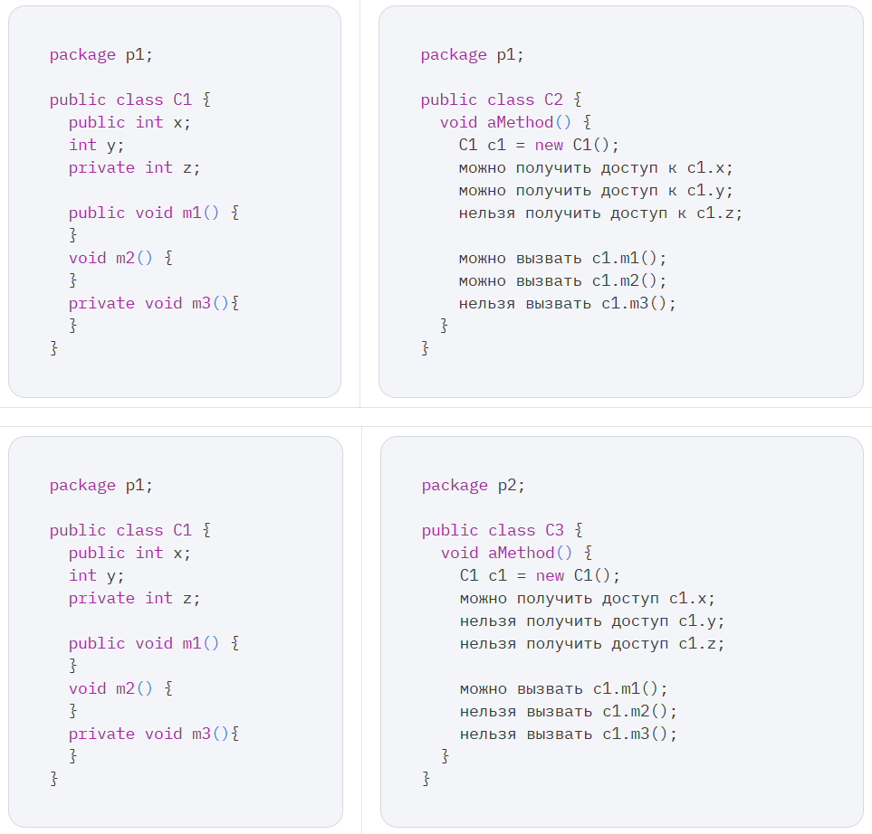
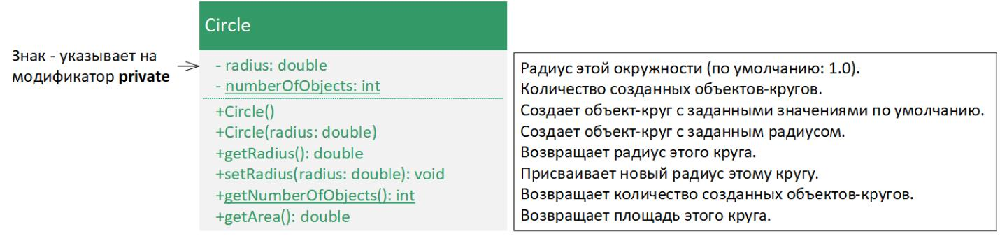

# Практическая работа №2 Объекты и классы: модификаторы доступа, инкапсуляция полей.

### Принципы ООП в Java и наследование классов, передача метода

## объектов.

## Теория

Доступ к классу и его элементам можно задавать с помощью модификаторов доступа. Чтобы ограничить доступ к классам, методам и полям данных, по умолчанию используется модификатор доступа private. Для доступа к методам обычно создаются геттеры и сеттеры, а при необходимости данные дублируются в новые переменные. В случае наследования для полей используются модификаторы protected или default, что обеспечивает доступ потомкам в пределах пакета. Модификатор public применяется реже и дает доступ к элементам класса из любых других классов. Пакеты можно использовать для организации классов. Для этого необходимо добавить следующую строчку в качестве первого предложения в программе: package имяПакета; Если класс определен без предложения package, то он помещается в заданный по умолчанию пакет. В современной разработке принято следовать правилу: один каталог соответствует одному пакету, в котором может быть любое количество классов. Это упрощает организацию кода и делает проект более структурированным.

В дополнение к модификатору доступа public и заданному по умолчанию, Java предоставляет модификаторы private и protected для элементов класса. Помимо модификаторов доступа public, private и protected, в Java существует четвертый модификатор — default, он применяется для элементов класса, к которым требуется доступ только внутри одного пакета. Этот модификатор важен для понимания более углубленных аспектов работы с доступом в Java. Модификатор private делает методы и поля данных доступными только внутри класса, чьими элементами они являются. В следующей таблице показано, можно ли получить доступ к полю данных или методу класса C1 с модификаторами public, private и заданному по умолчанию из класса C2 этого же пакета и из класса C3 другого пакета. Если класс не определен как public, доступ к нему возможен только внутри того же пакета. В современных проектах придерживаются практики: один пакет соответствует одному каталогу, при этом в пакете может находиться любое количество классов.

Модификатор доступа определяет, можно ли получить доступ к полям данных и методам класса за пределами этого класса. Не существует ограничений на доступ к полям данных и методам внутри класса. Модификатор private может применяться не только к методам, но и к полям класса, ограничивая доступ к ним из других классов. Модификатор public используется для классов и их элементов, чтобы обеспечить доступ извне. Важно отметить, что использование public и private для полей и методов внутри одного класса не приводит к ошибкам компиляции, даже если сам класс объявлен как public. Однако модификаторы доступа не могут применяться к локальным переменным. Использование private-полей позволяет скрыть детали реализации класса и ограничить доступ к его внутренним данным. Это помогает защитить данные от случайных изменений извне и гарантирует, что к ним можно обращаться только через специально созданные методы, что упрощает контроль и обслуживание кода. Такой подход реализует принцип инкапсуляции — один из ключевых принципов объектно-ориентированного программирования, который заключается в том, чтобы скрывать внутреннюю структуру объекта и обеспечивать доступ к его данным только через публичные методы, тем самым улучшая безопасность и управляемость кода. Например, поля данных radius и numberOfObjects в программе по вычислению окружности могут быть непосредственно (напрямую) изменены (например, c1.radius = 5 или Circle.numberOfObjects = 10). Это не очень хорошая практика — по двум причинам:

- Данные могут быть изменены несанкционированно. Например, поле numberOfObjects должно подсчитывать количество созданных объектов, но ему может быть ошибочно присвоено произвольное значение (например, Circle.numberOfObjects = 10).
- Класс становится трудно сопровождаем и уязвим к ошибкам. Предположим, что требуется изменить класс, чтобы можно было гарантировать, что радиус не отрицателен после того, как другие программы уже использовали этот класс. Необходимо изменить не только класс в котором происходят вычисления, но и программы, которые его используют, поскольку эти клиенты, возможно, изменили радиус напрямую (например, c1.radius = -5). Прежде чем объявлять поля данных скрытыми с помощью модификатора private, важно понять принцип инкапсуляции. Инкапсуляция — это механизм, который позволяет скрывать внутренние данные объекта и управлять доступом к ним через публичные методы, такие как геттеры и сеттеры. Это помогает защитить данные от несанкционированных изменений и делает код

более безопасным и управляемым. После этого понимания уже можно объявлять поля скрытыми с использованием модификатора private, что является одним из способов реализации инкапсуляции: Объект не может получить доступ к private-полю вне класса, определяющего это поле. Однако клиентам может потребоваться доступ к значениям полей данных. Чтобы предоставить такой доступ, следует использовать геттеры и сеттеры. Геттер-метод возвращает значение private-поля и также называется методом доступа (accessor). Сеттер-метод позволяет изменить значение private-поля и также называется методом модификации (mutator). Термин "mutator" может применяться не только к сеттерам, но и к любым методам, которые изменяют состояние объекта. public типВозвращаемогоЗначения getИмяПоля() public void setИмяПоля(ТипДанных значениеПоля)

Важно отметить, что модификатор void указывает на то, что метод не возвращает никакого значения. Это означает, что его задача заключается исключительно в изменении состояния объекта, а результат выполнения метода не передается обратно. Определим новый класс Circle с private-полем radius и связанными с ним методами getter и setter. UML-диаграмма классов представлена на следующем рисунке.

### Часть 1. Задача #1

Создайте пакет vehicles, который будет содержать классы Car и ElectricCar и пакет app, в котором будет находиться основной класс с методом main. Добавьте в класс Car приватные поля (private) ownerName и insuranceNumber. Создайте методы доступа (геттеры и сеттеры) для полей ownerName и insuranceNumber. Добавьте поле engineType с модификатором доступа protected и создайте методы доступа к этому полю.

### Часть 1. Задача #2

Создайте новый класс ElectricCar, который наследует класс Car, и добавьте в него поле batteryCapacity. В классе ElectricCar используйте поле engineType, чтобы задать тип двигателя как "Electric". Проверьте работу инкапсуляции и наследования, создав объекты классов Car и ElectricCar и продемонстрируйте доступ к полям с разными модификаторами.

### Часть 2. Задача #1

Ваша программа должна быть организована по пакетам: ● Пакет vehicles для классов Vehicle, Car, ElectricCar ● Пакет app для тестового класса TestCar. Используя программу, выполненную ранее, внести следующие изменения:

1. Добавить абстрактный класс Vehicle, который будет представлять общие свойства всех транспортных средств. В этот класс включите следующие общие поля для транспортных средств: model (модель); license (номерной знак); color (цвет); year (год выпуска); ownerName (имя владельца); insuranceNumber (страховой номер); engineType (тип двигателя, поле должно быть защищённым для наследования). Определите абстрактный метод vehicleType(), который будет возвращать тип транспортного средства. Добавьте методы для получения и изменения значений полей (геттеры и сеттеры).
- Изменить класс Car, чтобы он наследовал Vehicle. Реализуйте абстрактный метод vehicleType(), чтобы он возвращал "Car". В конструкторе класса Car используйте поля и методы родительского класса.
- Изменить класс ElectricCar, чтобы он наследовал Car. Добавьте в класс поле batteryCapacity (емкость аккумулятора) и методы для работы с ним. Реализуйте метод vehicleType(), который будет возвращать "Electric Car". Используйте protected-поле engineType для установки значения "Electric" в классе ElectricCar.
- Использовать полиморфизм в тестовом классе для работы с объектами Car и ElectricCar через ссылки на родительские классы. Создайте объекты Car и ElectricCar, измените их свойства с помощью сеттеров, и выведите информацию на экран с помощью метода toString().
- Включить инкапсуляцию: убедитесь, что поля каждого класса имеют доступ через методы (геттеры и сеттеры), а не напрямую.
